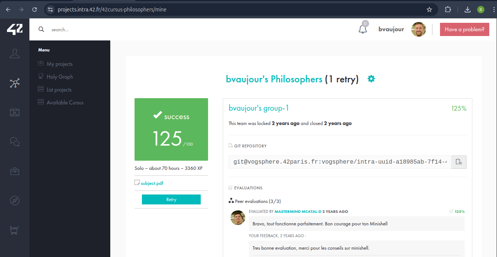

# philosophers

Projet de niveau 4 de l'école 42.

Simulation du problème des philosophes mangeurs, où plusieurs philosophes alternent entre manger, dormir et réfléchir en utilisant des fourchettes partagées. Le but est d'éviter les interblocages et de gérer la synchronisation entre les threads.

### Fonctionnalités principales :
- **Gestion des threads :** Utilisation de threads pour simuler les philosophes.
- **Synchronisation :** Utilisation des sémaphores ou mutex pour éviter les interblocages et les conditions de course.
- **Temps de réflexion et de repas :** Implémentation des comportements de chaque philosophe avec des durées aléatoires de réflexion et de repas.

[Voir le sujet](./subject.pdf)

